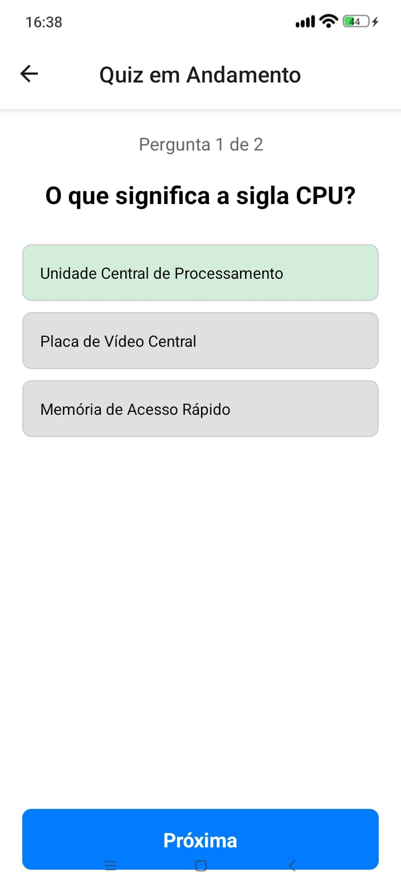

# NeuroQuiz 

### Apresentação do Projeto de Interface

**Autor:** Lucas S.
**Disciplina:** Programação para Dispositivos Móveis
**Data:** 10 de Junho de 2025

---

## O Aplicativo: NeuroQuiz

NeuroQuiz é um aplicativo móvel inovador que utiliza o poder da Inteligência Artificial para gerar quizzes personalizados e interativos automaticamente a partir de qualquer texto fornecido pelo usuário.

Ideal para estudantes ou qualquer pessoa que deseje reforçar o conhecimento, ele transforma a revisão de conteúdo em uma experiência de aprendizado ativa e eficiente.

---

## Principais Funcionalidades

*  **Geração Automática de Quiz:** (Funcionalidade futura) Usa a API da OpenAI para criar perguntas a partir do texto do usuário.
*  **Quiz Interativo:** Responda perguntas e receba feedback visual imediato de certo ou errado.
*  **Histórico de Desempenho:** Acompanhe seus resultados, reveja os detalhes de quizzes passados e gerencie seu histórico.
*  **Interface Intuitiva:** Design moderno e minimalista com uma experiência de usuário clara e navegação funcional.

---

## Público-Alvo

* **Estudantes:** Ensino médio, universitários e autodidatas.
* **Professores:** Criando atividades de fixação rápidas para suas aulas.

---

## Arquitetura do Sistema

A modelagem do sistema foi dividida entre entidades de dados e classes de serviço para estruturar a aplicação.

## Entidades e Casos de Uso na Prática
O sistema foi modelado com 8 classes principais, que se dividem em duas categorias:

*  **6 Entidades de Dados:** Representam as informações que o sistema guarda.
* **2 Classes de Serviço:** Representam as ações que o sistema executa.

### Tela 1: Tela Inicial

---

### Tela 2: Pergunta 1

---

### Tela 3: Pergunta 2

---

### Tela 4: Resultado do Quiz

---

### Tela 5: Detalhes do Quiz (do Histórico)

---

### Tela 6: Histórico

---

### Tela 7: Tela Sobre o Aplicativo
